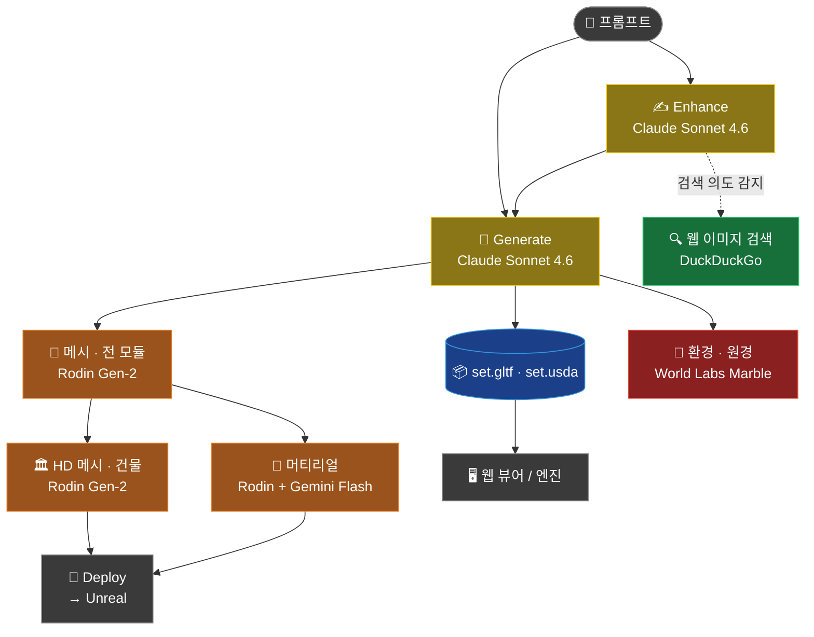
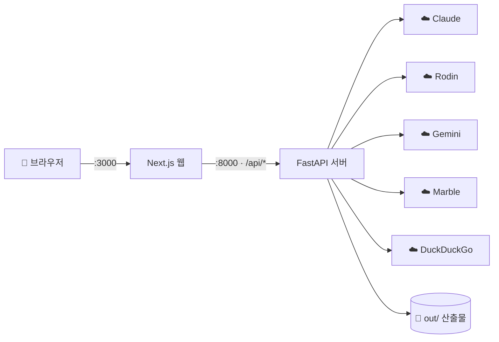

# 🎬 SetLab

> **텍스트 한 줄 → 3D 세트.** 프롬프트를 구조화된 씬 레이아웃으로 바꾸고, 3D 메시·텍스처·환경까지 생성해 **Unreal / Unity / Blender** 로 내보내는 AI 버추얼 프로덕션 파이프라인.

<table>
<tr>
<td>🌐 <b>웹 앱</b></td><td>Next.js <code>:3000</code> + FastAPI <code>:8000</code> (메인)</td>
</tr>
<tr>
<td>🖥️ <b>CLI</b></td><td><code>python -m setlab.run</code> (스크립팅/배치용)</td>
</tr>
<tr>
<td>📦 <b>산출물</b></td><td><code>set_spec.json</code> · <code>set.gltf</code> · <code>set.usda</code></td>
</tr>
</table>

---

## 📑 목차

1. [SetLab이란](#-setlab이란)
2. [전체 파이프라인](#️-전체-파이프라인)
3. [사용하는 AI 모델](#-사용하는-ai-모델)
4. [비용 한눈에](#-비용-한눈에)
5. [필요한 API 키](#-필요한-api-키)
6. [설치 & 실행 (웹)](#-설치--실행-웹)
7. [CLI 사용 (선택)](#️-cli-사용-선택)
8. [설정 (.env)](#️-설정-env)
9. [⚡ 속도·비용 최적화](#-속도비용-최적화)
10. [🩹 트러블슈팅](#-트러블슈팅)
11. [엔진에서 보기](#-엔진에서-보기)
12. [현재 검증 상태](#-현재-검증-상태)
13. [🔒 보안 주의](#-보안-주의)
14. [추가 문서](#-추가-문서)

---

## 🎯 SetLab이란

세트 디자이너/버추얼 프로덕션을 위한 **AI 기반 3D 세트 생성 도구**입니다.

```
"중세 마을 광장, 석조 건물 4채"
        │
        ▼
   구조화된 레이아웃(JSON)  ──►  실제 3D 메시  ──►  텍스처  ──►  환경  ──►  Unreal/Unity/Blender
```

각 단계를 **서로 다른 전문 AI**가 담당합니다(같은 일을 하는 모델이 여러 개가 아니라, 단계별 분업). 웹 UI에서 **프롬프트 → Enhance → Generate** 흐름으로 쓰며, 메시·HD·머티리얼·환경은 자동 또는 버튼으로 단계 실행합니다.

---

## 🗺️ 전체 파이프라인



> 🟡 **Claude** (가벼운 유료) · 🟢 **무료**(DuckDuckGo) · 🟠 **Rodin**(무거운 유료) · 🔴 **Marble**(가장 무거운 유료) · 🔵 **산출물**

**시스템 구성**



> 💡 위 두 다이어그램은 **GitHub·VS Code에서 실제 그림으로 렌더**됩니다(Mermaid). 일반 텍스트 편집기에선 코드로 보입니다.

> 🔧 **실시간 수정**: 씬 로드 후 `"안개 더 짙게"` 같은 지시를 주면 Claude가 `instant / fast / moderate` 3단계로 분류해 즉시 반영(조명·안개) 또는 리텍스처/재생성합니다.

---

## 🧠 사용하는 AI 모델

| 단계 | 모델 / 서비스 | 현재 설정값 | 과금 |
|------|--------------|------------|:----:|
| 레이아웃 생성 · refine · 실시간 수정 분류 · Enhance | **Claude Sonnet 4.6** (Anthropic) | `claude-sonnet-4-6` | 💸 |
| 웹 이미지검색 **의도 판정** (경량) | **Claude Haiku 4.5** | `claude-haiku-4-5-20251001` | 💸 |
| **3D 메시 / HD / 머티리얼** | **Hyper3D Rodin Gen-2** | tier `Regular`, poly `50000` | 💸💸 |
| **참조 이미지 생성** | **Google Gemini Flash** (Nano Banana 2) | `gemini-3.1-flash-image` | 💸 |
| 웹 이미지 **검색** | DuckDuckGo (`ddgs`) | — | 🆓 |
| **환경(원경) 생성** | **World Labs Marble** | `Marble 0.1-plus` | 💸💸💸 |

**대안(설정 가능, 현재 미사용)**

| 용도 | 대안 | 비고 |
|------|------|------|
| LLM | **Ollama** (로컬) | `BACKEND=ollama` → 호출당 비용 0 (로컬 GPU/CPU) |
| 참조 이미지 | **Flux 1.1 Pro** | `IMAGE_GEN_BACKEND=flux` (현재는 `google`) |
| 빠른 점검 | **mock** 백엔드 | `BACKEND=mock` → 외부호출 0, 고정 샘플 레이아웃 |

> 모델 상수는 `setlab/model_ids.py`(Python) · `web/lib/models.ts`(웹)에서 단일 관리됩니다.

---

## 💰 비용 한눈에

```
💸💸💸  World Labs Marble   환경 1회 = 5~10분, 2M splat 생성 — 단일 단계 중 가장 무거움
💸💸    Hyper3D Rodin       메시/HD/머티리얼 — 모듈 수 × 호출당 과금 (3D 비용의 핵심)
💸      Claude / Gemini     텍스트·이미지 — 상대적으로 가벼움
🆓      DuckDuckGo / Ollama / mock   무료
```

> ⚠️ **느림·비용의 주범은 모델 종류가 아니라 "Generate 한 번에 무거운 단계를 다 도는 것"** 입니다.
> 현재 기본 설정(`AUTO_PIPELINE=mesh+hd`, `AUTO_STUDIO_COMPLETE=full`)이면 Generate 1회 = 레이아웃 + 메시(전 모듈) + HD + 머티리얼 + Deploy + **Marble** 까지 전부 자동 실행됩니다.
> → [⚡ 속도·비용 최적화](#-속도비용-최적화) 참고.

---

## 🔑 필요한 API 키

| 키 | 무엇에 필요한가 | 필수도 | 발급처 |
|----|----------------|:------:|--------|
| `ANTHROPIC_API_KEY` | 레이아웃·Enhance·수정·검색의도 (Claude 전부) | ⭐ **필수** | console.anthropic.com |
| `RODIN_API_KEY` *(= `HYPER3D_API_KEY`)* | 실제 3D 메시 / HD / 머티리얼 | 3D 하려면 필수 | developer.hyper3d.ai |
| `GOOGLE_API_KEY` | 참조 이미지 생성 (현재 백엔드) | 이미지생성 시 | Google AI Studio |
| `FLUX_API_KEY` | 참조 이미지 (대안, 현재 미사용) | 선택 | docs.bfl.ai |
| `WORLDLABS_API_KEY` | 환경(Marble) 생성 | 선택 | worldlabs.ai |
| `SETLAB_API_TOKEN` *(+ `NEXT_PUBLIC_SETLAB_API_TOKEN`)* | 앱 자체 토큰 인증 (외부 키 아님) | 선택(보안) | 직접 생성 |

> **최소 구성**: `ANTHROPIC_API_KEY` 하나면 레이아웃·Enhance·수정·이미지검색까지 됩니다.
> 실제 3D까지 가려면 `RODIN_API_KEY`, 참조 이미지 자동생성까지면 `GOOGLE_API_KEY`(또는 `FLUX_API_KEY`)를 추가하세요.

키는 전부 **루트 `.env`** 에 넣습니다 (`.env`는 `.gitignore`라 안전):

```bash
ANTHROPIC_API_KEY=...
RODIN_API_KEY=...
GOOGLE_API_KEY=...
# WORLDLABS_API_KEY=...   # 환경 생성 쓸 때만
```

---

## 🚀 설치 & 실행 (웹)

> 🍎 macOS / zsh 기준. **터미널 2개**(서버·웹)를 띄웁니다.

### 0️⃣ 최초 1회 — 의존성

```bash
cd /Users/jkjung/project/setlab

# Python (venv는 머신마다 새로 생성 — 복사·이동 금지)
python3 -m venv .venv
source .venv/bin/activate
python -m pip install --upgrade pip
python -m pip install -r requirements.txt -r server/requirements.txt

# 웹
cd web && npm install && cd ..
```

> ⚠️ **둘 다 설치하세요.** 서버 엔드포인트가 루트 `requirements.txt`의 패키지(Pillow·json-repair·google-genai·ddgs 등)를 씁니다. `server/requirements.txt`만 깔면 첫 요청에서 `ModuleNotFoundError`가 납니다.

### 1️⃣ 서버 — 터미널 A (`:8000`)

```bash
cd /Users/jkjung/project/setlab
source .venv/bin/activate
cd server && uvicorn main:app --reload --port 8000
```
✅ `Uvicorn running on http://127.0.0.1:8000` + `Application startup complete`

### 2️⃣ 웹 — 터미널 B (`:3000`)

```bash
cd /Users/jkjung/project/setlab/web
npm run dev
```
✅ `✓ Ready` → 브라우저에서 **http://localhost:3000**

> 프롬프트 입력 → **Enhance**(선택) → **Generate** → 뷰어에 씬이 뜨면 정상.

---

## 🖥️ CLI 사용 (선택)

웹 없이 배치/스크립트로 레이아웃→파일을 뽑을 때:

```bash
source .venv/bin/activate

# Claude 백엔드
python -m setlab.run my_brief.txt --out out/run1 --backend claude --model claude-sonnet-4-6

# 로컬 LLM(Ollama, 무료)
python -m setlab.run my_brief.txt --out out/run1 --backend ollama --model llama3.2

# 외부호출 0 — 파이프라인 점검용
python -m setlab.run examples/brief_corridor.txt --out out/mock --backend mock
```

산출물: `set_spec.json` · `set.gltf` · `set.usda` (아래 [산출물](#-산출물) 참고)

---

## ⚙️ 설정 (.env)

| 변수 | 의미 | 예시 / 기본 |
|------|------|------------|
| `BACKEND` | 레이아웃 LLM 백엔드 | `claude` \| `ollama` \| `mock` |
| `MODEL` | Claude/Ollama 모델 | `claude-sonnet-4-6` |
| `IMAGE_GEN_BACKEND` | 참조 이미지 백엔드 | `google` \| `flux` |
| `GOOGLE_IMAGE_MODEL` | Gemini 이미지 모델 | `gemini-3.1-flash-image` |
| `RODIN_TIER` / `RODIN_QUALITY_OVERRIDE` | Rodin 품질·폴리곤 | `Regular` / `50000` |
| `SETLAB_MAX_MODULES` | 레이아웃 모듈 상한 | `10` |
| `NEXT_PUBLIC_AUTO_PIPELINE_AFTER_GENERATE` | Generate 직후 자동 단계 | `false` \| `mesh` \| `mesh+hd` \| `all` |
| `NEXT_PUBLIC_AUTO_STUDIO_COMPLETE` | 머티리얼·Deploy·Marble 자동 | `` (끔) \| `1`(Marble 제외) \| `full`(전부) |
| `SETLAB_API_TOKEN` / `SETLAB_BROWSE_ROOTS` | 토큰 인증 / 탐색 루트 제한 | (선택 보안) |

> `NEXT_PUBLIC_*` 는 프론트가 **시작 시** 읽습니다 → 바꾸면 **웹 재시작** 필요.
> 그 외(서버용)는 **uvicorn 재시작** 시 반영됩니다.

---

## ⚡ 속도·비용 최적화

가장 큰 절감부터:

### 1) 자동 전체 파이프라인 끄기 ⭐ (체감 제일 큼)

```diff
# .env
- NEXT_PUBLIC_AUTO_PIPELINE_AFTER_GENERATE=mesh+hd
+ NEXT_PUBLIC_AUTO_PIPELINE_AFTER_GENERATE=false   # Generate=레이아웃만(초 단위)

- NEXT_PUBLIC_AUTO_STUDIO_COMPLETE=full
+ NEXT_PUBLIC_AUTO_STUDIO_COMPLETE=                # 머티리얼·Deploy·Marble 자동 끔
```
→ Generate가 **레이아웃만** 즉시 생성. 메시·HD·머티리얼은 **필요할 때 버튼으로** 실행.

### 2) Marble만 정확히 끄기

```diff
- NEXT_PUBLIC_AUTO_STUDIO_COMPLETE=full   # 머티리얼 + Deploy + Marble
+ NEXT_PUBLIC_AUTO_STUDIO_COMPLETE=1      # 머티리얼 + Deploy (Marble 제외)
```

### 3) 그 외
- `SETLAB_MAX_MODULES=6` — Rodin 호출 수 ↓
- HD·머티리얼은 **최종에만** (반복 작업엔 base 메시로 충분)
- 이미지 백엔드는 **하나만**(`google` 또는 `flux`), 또는 웹검색·생략
- 더 싼 메시 공급자가 필요하면 **Tripo / Meshy**(상용) 또는 **Hunyuan3D / TripoSR**(셀프호스트, 호출당 $0) — 단, 메시 백엔드 추가는 코드 작업 필요(현재 메시는 Rodin 고정)

---

## 🩹 트러블슈팅

> 이 프로젝트를 새 머신에서 띄울 때 실제로 마주친 이슈와 해결법.

<details open>
<summary><b>❌ <code>command not found: pip</code> / <code>python</code> (venv 활성화했는데도)</b></summary>

**원인**: `.venv`가 깨졌거나 다른 머신에서 복사돼 PATH에 안 잡힘.
**해결**: venv 재생성.
```bash
deactivate 2>/dev/null
cd /Users/jkjung/project/setlab
rm -rf .venv
python3 -m venv .venv && source .venv/bin/activate
python -m pip install -r requirements.txt -r server/requirements.txt
```
</details>

<details>
<summary><b>❌ <code>command not found: uvicorn</code></b></summary>

**원인**: venv 비활성 상태 (프롬프트에 `(.venv)` 가 없음).
**해결**: 활성화 후 실행.
```bash
source /Users/jkjung/project/setlab/.venv/bin/activate
uvicorn main:app --reload --port 8000
```
</details>

<details>
<summary><b>❌ 웹: <code>library load disallowed by system policy</code> (@next/swc-darwin-arm64)</b></summary>

**원인**: `node_modules`가 브라우저(Chrome)로 받은 zip을 푼 것이라 네이티브 바이너리에 **격리(quarantine) 플래그**가 붙음 → macOS가 로드 거부.
**해결**: 격리 플래그 제거.
```bash
xattr -dr com.apple.quarantine web/node_modules
# 그래도 다른 .node 에서 또 나면:
find web/node_modules -name '*.node' -print0 | xargs -0 xattr -d com.apple.quarantine 2>/dev/null
```
</details>

<details>
<summary><b>❌ <code>[Errno 48] Address already in use</code> (포트 8000)</b></summary>

**원인**: 이전 uvicorn 프로세스가 살아있음(다른 탭/잔존).
**해결**: 점유 프로세스 종료.
```bash
lsof -ti:8000 | xargs kill -9
# 또는
pkill -9 -f "uvicorn main:app"
```
</details>

<details>
<summary><b>❌ <code>localhost:3000 refused to connect</code></b></summary>

**원인**: 웹 dev 서버가 안 떠 있음.
**해결**: `cd web && npm run dev` 후 `✓ Ready` 확인.
</details>

<details>
<summary><b>ℹ️ <code>pydantic_core ... not valid for use in process</code></b></summary>

특정 샌드박스/에이전트 프로세스 한정 정책입니다. **본인 일반 터미널에선 정상**이며, 위 venv 재생성으로 해결됩니다.
</details>

---

## 📦 산출물

각 run 폴더(`out/<run_id>/`)에 생성:

| 파일 | 내용 |
|------|------|
| `set_spec.json` | 모듈 배치 스펙 (위치·회전·스케일) |
| `set.gltf` | glTF 2.0 (버퍼 임베디드 — 단일 파일, 웹 뷰어가 로드) |
| `set.usda` | USD Stage (큐브 프록시, prim 이름 새니타이즈됨) |
| `meshes/` | Rodin이 생성한 GLB (메시 단계 실행 시) |

회전 규약은 **Three.js XYZ Euler 순서**로 통일 (`setlab/rotation_math.py`).

---

## 🎮 엔진에서 보기

| 도구 | 방법 |
|------|------|
| **Blender** | `File → Import → glTF` 로 `set.gltf` |
| **Unity** | glTFast 등 glTF 패키지로 임포트 |
| **Unreal** | glTF 임포터 / Datasmith, 또는 자동 워처 `scripts/ue_set_watcher.py` |
| **USD** | `usdview set.usda` |

---

## ✅ 현재 검증 상태

> 마지막 검증: 2026-06-09 · 브랜치 `code-review-fixes`

**🟢 실제로 돌려서 확인됨**
- 서버 부팅 · Claude(enhance + 커넥션 풀링) · `/api/config`
- **Generate → 레이아웃 → `set.gltf`+`set.usda` 생성 → `/api/outputs` 서빙 (HTTP 200, 유효 glTF)**
- 웹 이미지 검색(`ddgs`) → 이미지 반환
- 웹 타입체크 `tsc` 0 에러 · Python `py_compile` · 회전 테스트 통과

**🟡 아직 미실행 (고장 아님 — 비용/브라우저 필요)**
- 브라우저 화면 렌더 · 실제 Rodin 3D 메시 / HD / 머티리얼 · Marble 환경 · UE Deploy

---

## 🔒 보안 주의

- ✅ `.env` 는 `.gitignore` → 실제 키 안전.
- ⚠️ **`.env.example` 에 노출된 실제같은 키 폐기 필요**: `FLUX_API_KEY`·`WORLDLABS_API_KEY` 값이 첫 커밋부터 git에 박혀 있습니다. **해당 키를 폐기/재발급**하고 `.env.example`은 빈 placeholder로 정리하세요. (히스토리에 남아 있어 파일만 지워도 과거 커밋엔 잔존)

---

## 📚 추가 문서

| 문서 | 내용 |
|------|------|
| [`docs/PROJECT_SUMMARY.md`](docs/PROJECT_SUMMARY.md) | 전체 구조 요약 |
| [`docs/START_UNREAL_FIRST.md`](docs/START_UNREAL_FIRST.md) | Unreal 먼저 잡고 시작 |
| [`docs/UNREAL_AUTO_PLACEMENT.md`](docs/UNREAL_AUTO_PLACEMENT.md) | UE 자동 배치 |
| [`docs/UNREAL_AUTO_IMPORT_SETUP.md`](docs/UNREAL_AUTO_IMPORT_SETUP.md) | glTF → UE 자동 반영 |
| [`docs/INZOI_STYLE_SET_STEP_BY_STEP.md`](docs/INZOI_STYLE_SET_STEP_BY_STEP.md) | inZOI 류 도시 세트 단계별 |
| [`docs/PROMPT_TO_VIEWPORT.md`](docs/PROMPT_TO_VIEWPORT.md) | 프롬프트 → 엔진 폴더 복사 |
| `schemas/set_spec.schema.json` | `SetSpec` JSON 스키마 |

---

<sub>🤖 이 README는 코드베이스 실측(모델·포트·산출물·트러블슈팅)을 기반으로 작성되었습니다.</sub>
