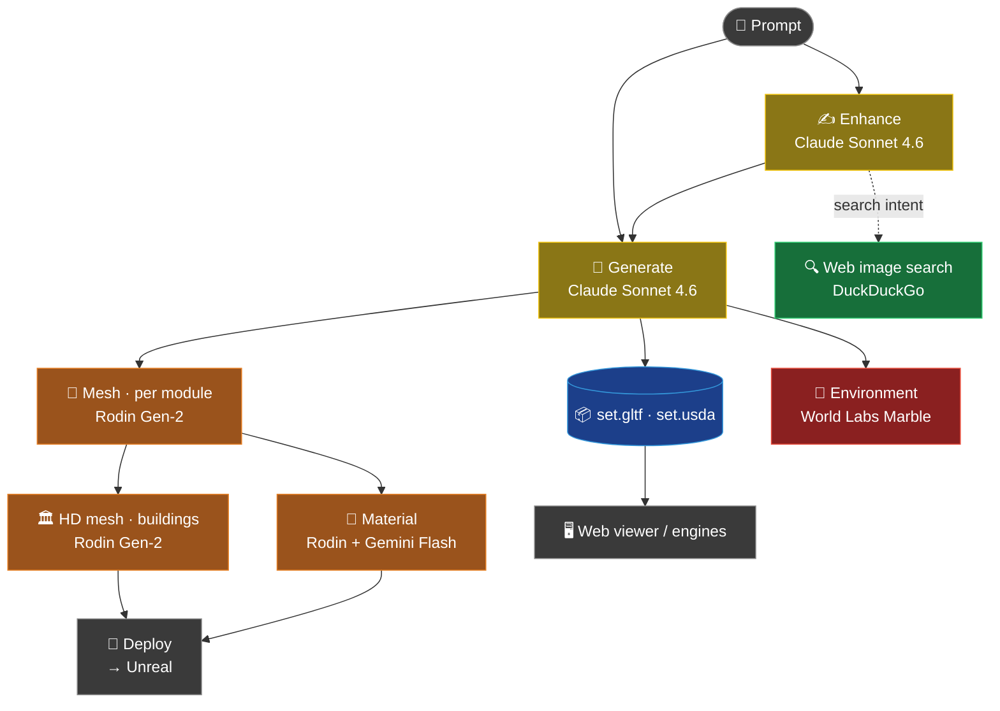
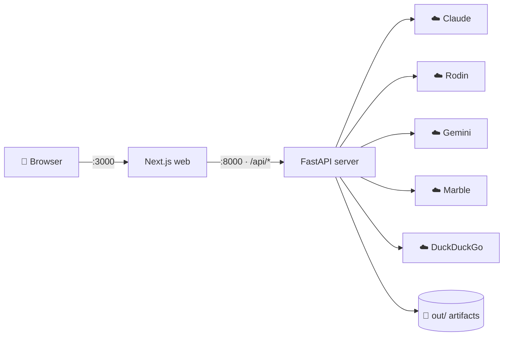

# 🎬 SetLab

> **One line of text → a 3D set.** SetLab turns a prompt into a structured scene layout, then generates 3D meshes, textures, and environments, and exports them to **Unreal / Unity / Blender**. An AI virtual‑production pipeline.

<table>
<tr><td>🌐 <b>Web app</b></td><td>Next.js <code>:3000</code> + FastAPI <code>:8000</code> (primary)</td></tr>
<tr><td>🖥️ <b>CLI</b></td><td><code>python -m setlab.run</code> (scripting / batch)</td></tr>
<tr><td>📦 <b>Outputs</b></td><td><code>set_spec.json</code> · <code>set.gltf</code> · <code>set.usda</code></td></tr>
</table>

---

## 📑 Table of Contents

1. [What is SetLab](#-what-is-setlab)
2. [Pipeline](#️-pipeline)
3. [AI models](#-ai-models)
4. [Cost at a glance](#-cost-at-a-glance)
5. [API keys](#-api-keys)
6. [Setup & run (web)](#-setup--run-web)
7. [CLI usage](#️-cli-usage)
8. [Configuration (.env)](#️-configuration-env)
9. [⚡ Speed & cost optimization](#-speed--cost-optimization)
10. [🩹 Troubleshooting](#-troubleshooting)
11. [Viewing in engines](#-viewing-in-engines)
12. [Verification status](#-verification-status)
13. [🔒 Security](#-security)
14. [Further docs](#-further-docs)

---

## 🎯 What is SetLab

An **AI-driven 3D set generator** for set designers and virtual production.

```
"medieval village square, four stone buildings"
        │
        ▼
   structured layout (JSON)  ──►  real 3D meshes  ──►  textures  ──►  environment  ──►  Unreal/Unity/Blender
```

Each stage is handled by a **different specialized AI** — not several models doing the same job, but a division of labor across the pipeline. In the web UI the flow is **Prompt → Enhance → Generate**; meshes, HD, materials, and environment then run automatically or via buttons.

---

## 🗺️ Pipeline



> 🟡 **Claude** (light, paid) · 🟢 **free** (DuckDuckGo) · 🟠 **Rodin** (heavy, paid) · 🔴 **Marble** (heaviest, paid) · 🔵 **output**

**System architecture**



> 💡 Both diagrams render as real images on **GitHub / VS Code** (Mermaid). In a plain text editor they appear as code.

> 🔧 **Real-time edits**: after a scene loads, an instruction like `"make the fog thicker"` is classified by Claude into one of three tiers — `instant` (lighting/fog, applied immediately), `fast` (re-texture), or `moderate` (regenerate specific modules).

---

## 🧠 AI models

| Stage | Model / service | Configured value | Paid |
|-------|-----------------|------------------|:----:|
| Layout · refine · real-time edit classification · Enhance | **Claude Sonnet 4.6** (Anthropic) | `claude-sonnet-4-6` | 💸 |
| Web-search **intent detection** (lightweight) | **Claude Haiku 4.5** | `claude-haiku-4-5-20251001` | 💸 |
| **3D mesh / HD / material** | **Hyper3D Rodin Gen-2** | tier `Regular`, poly `50000` | 💸💸 |
| **Reference image generation** | **Google Gemini Flash** (Nano Banana 2) | `gemini-3.1-flash-image` | 💸 |
| Web image **search** | DuckDuckGo (`ddgs`) | — | 🆓 |
| **Environment generation** | **World Labs Marble** | `Marble 0.1-plus` | 💸💸💸 |

**Alternatives (configurable, currently unused)**

| Purpose | Alternative | Note |
|---------|-------------|------|
| LLM | **Ollama** (local) | `BACKEND=ollama` → $0 per call (local GPU/CPU) |
| Reference image | **Flux 1.1 Pro** | `IMAGE_GEN_BACKEND=flux` (currently `google`) |
| Quick check | **mock** backend | `BACKEND=mock` → no external calls, fixed sample layout |

> Model IDs are managed in one place: `setlab/model_ids.py` (Python) and `web/lib/models.ts` (web).

---

## 💰 Cost at a glance

```
💸💸💸  World Labs Marble   1 environment = 5–10 min, 2M splats — the single heaviest step
💸💸    Hyper3D Rodin       mesh / HD / material — billed per call × number of modules (the bulk of 3D cost)
💸      Claude / Gemini     text & images — relatively light
🆓      DuckDuckGo / Ollama / mock   free
```

> ⚠️ **The slowness/cost is not the variety of models — it's running every heavy stage on a single Generate.**
> With the eager defaults (`AUTO_PIPELINE=mesh+hd`, `AUTO_STUDIO_COMPLETE=full`), one Generate runs layout + mesh (all modules) + HD + material + Deploy + **Marble**.
> → See [⚡ Speed & cost optimization](#-speed--cost-optimization).

---

## 🔑 API keys

| Key | Used for | Required? | Get it at |
|-----|----------|:---------:|-----------|
| `ANTHROPIC_API_KEY` | Layout · Enhance · edits · search intent (all Claude) | ⭐ **required** | console.anthropic.com |
| `RODIN_API_KEY` *(= `HYPER3D_API_KEY`)* | Real 3D mesh / HD / material | required for 3D | developer.hyper3d.ai |
| `GOOGLE_API_KEY` | Reference image generation (current backend) | for image gen | Google AI Studio |
| `FLUX_API_KEY` | Reference images (alternative, unused) | optional | docs.bfl.ai |
| `WORLDLABS_API_KEY` | Environment (Marble) generation | optional | worldlabs.ai |
| `SETLAB_API_TOKEN` *(+ `NEXT_PUBLIC_SETLAB_API_TOKEN`)* | App bearer-token auth (not an external key) | optional (security) | self-generated |

> **Minimum setup**: `ANTHROPIC_API_KEY` alone covers layout, Enhance, edits, and image search.
> Add `RODIN_API_KEY` for actual 3D, and `GOOGLE_API_KEY` (or `FLUX_API_KEY`) for auto-generated reference images.

Put all keys in the root **`.env`** (`.env` is `.gitignore`d, so it is safe):

```bash
ANTHROPIC_API_KEY=...
RODIN_API_KEY=...
GOOGLE_API_KEY=...
# WORLDLABS_API_KEY=...   # only if you use environment generation
```

---

## 🚀 Setup & run (web)

> 🍎 macOS / zsh. Use **two terminals** (server + web).

### 0️⃣ One-time — dependencies

```bash
cd /Users/jkjung/project/setlab

# Python (recreate the venv per machine — never copy/move it)
python3 -m venv .venv
source .venv/bin/activate
python -m pip install --upgrade pip
python -m pip install -r requirements.txt -r server/requirements.txt

# Web
cd web && npm install && cd ..
```

> ⚠️ **Install both requirements files.** Server endpoints import `setlab` modules that need packages from the root `requirements.txt` (Pillow, json-repair, google-genai, ddgs, …). Installing only `server/requirements.txt` causes `ModuleNotFoundError` on the first request.

### 1️⃣ Server — terminal A (`:8000`)

```bash
cd /Users/jkjung/project/setlab
source .venv/bin/activate
cd server && uvicorn main:app --reload --port 8000
```
✅ `Uvicorn running on http://127.0.0.1:8000` + `Application startup complete`

### 2️⃣ Web — terminal B (`:3000`)

```bash
cd /Users/jkjung/project/setlab/web
npm run dev
```
✅ `✓ Ready` → open **http://localhost:3000**

> Enter a prompt → **Enhance** (optional) → **Generate** → the scene appears in the viewer.

---

## 🖥️ CLI usage

For batch/scripted layout → file generation without the web app:

```bash
source .venv/bin/activate

# Claude backend
python -m setlab.run my_brief.txt --out out/run1 --backend claude --model claude-sonnet-4-6

# Local LLM (Ollama, free)
python -m setlab.run my_brief.txt --out out/run1 --backend ollama --model llama3.2

# No external calls — pipeline smoke test
python -m setlab.run examples/brief_corridor.txt --out out/mock --backend mock
```

Outputs: `set_spec.json` · `set.gltf` · `set.usda` (see [Outputs](#-outputs)).

---

## ⚙️ Configuration (.env)

| Variable | Meaning | Example / default |
|----------|---------|-------------------|
| `BACKEND` | Layout LLM backend | `claude` \| `ollama` \| `mock` |
| `MODEL` | Claude/Ollama model | `claude-sonnet-4-6` |
| `IMAGE_GEN_BACKEND` | Reference-image backend | `google` \| `flux` |
| `GOOGLE_IMAGE_MODEL` | Gemini image model | `gemini-3.1-flash-image` |
| `RODIN_TIER` / `RODIN_QUALITY_OVERRIDE` | Rodin quality / polycount | `Regular` / `50000` |
| `SETLAB_MAX_MODULES` | Cap on layout modules | `10` |
| `NEXT_PUBLIC_AUTO_PIPELINE_AFTER_GENERATE` | Auto steps after Generate | `false` \| `mesh` \| `mesh+hd` \| `all` |
| `NEXT_PUBLIC_AUTO_STUDIO_COMPLETE` | Auto material/Deploy/Marble | `` (off) \| `1` (no Marble) \| `full` (all) |
| `SETLAB_API_TOKEN` / `SETLAB_BROWSE_ROOTS` | Token auth / browse-root allowlist | (optional security) |

> `NEXT_PUBLIC_*` are read by the frontend **at startup** → changing them requires **restarting the web** (`npm run dev`).
> Other (server) vars are picked up when you **restart uvicorn**.

---

## ⚡ Speed & cost optimization

Biggest savings first:

### 1) Turn off the eager auto-pipeline ⭐ (largest impact)

```diff
# .env
- NEXT_PUBLIC_AUTO_PIPELINE_AFTER_GENERATE=mesh+hd
+ NEXT_PUBLIC_AUTO_PIPELINE_AFTER_GENERATE=false   # Generate = layout only (seconds)

- NEXT_PUBLIC_AUTO_STUDIO_COMPLETE=full
+ NEXT_PUBLIC_AUTO_STUDIO_COMPLETE=                # no auto material/Deploy/Marble
```
→ Generate produces **just the layout**, instantly. Run mesh / HD / material **on demand** with buttons.

### 2) Disable Marble only

```diff
- NEXT_PUBLIC_AUTO_STUDIO_COMPLETE=full   # material + Deploy + Marble
+ NEXT_PUBLIC_AUTO_STUDIO_COMPLETE=1      # material + Deploy (no Marble)
```

### 3) Other levers
- `SETLAB_MAX_MODULES=6` — fewer Rodin calls
- Run HD & material **only on a final pass** (a base mesh is enough while iterating)
- Use a **single** image backend (`google` or `flux`), or web search / skip
- Need a cheaper mesh provider? **Tripo / Meshy** (commercial) or **Hunyuan3D / TripoSR** (self-host, $0 per call) — note: mesh gen is currently Rodin-only, so adding a backend requires code work.

---

## 🩹 Troubleshooting

> Issues actually hit while bringing this up on a fresh machine, with fixes.

<details open>
<summary><b>❌ <code>command not found: pip</code> / <code>python</code> (even with the venv active)</b></summary>

**Cause**: the `.venv` is broken or was copied from another machine, so it isn't on `PATH`.
**Fix**: recreate the venv.
```bash
deactivate 2>/dev/null
cd /Users/jkjung/project/setlab
rm -rf .venv
python3 -m venv .venv && source .venv/bin/activate
python -m pip install -r requirements.txt -r server/requirements.txt
```
</details>

<details>
<summary><b>❌ <code>command not found: uvicorn</code></b></summary>

**Cause**: the venv is not active (no `(.venv)` in the prompt).
**Fix**:
```bash
source /Users/jkjung/project/setlab/.venv/bin/activate
uvicorn main:app --reload --port 8000
```
</details>

<details>
<summary><b>❌ Web: <code>library load disallowed by system policy</code> (@next/swc-darwin-arm64)</b></summary>

**Cause**: `node_modules` was unpacked from a browser-downloaded zip, so the native binaries carry a **quarantine flag** that macOS refuses to load.
**Fix**: clear the quarantine flag.
```bash
xattr -dr com.apple.quarantine web/node_modules
# if another .node still trips it:
find web/node_modules -name '*.node' -print0 | xargs -0 xattr -d com.apple.quarantine 2>/dev/null
```
</details>

<details>
<summary><b>❌ <code>[Errno 48] Address already in use</code> (port 8000)</b></summary>

**Cause**: a previous uvicorn process is still alive.
**Fix**:
```bash
lsof -ti:8000 | xargs kill -9
# or
pkill -9 -f "uvicorn main:app"
```
</details>

<details>
<summary><b>❌ <code>localhost:3000 refused to connect</code></b></summary>

**Cause**: the web dev server isn't running.
**Fix**: `cd web && npm run dev`, wait for `✓ Ready`.
</details>

<details>
<summary><b>ℹ️ <code>pydantic_core ... not valid for use in process</code></b></summary>

A sandbox/agent-process-only policy. **It does not occur in a normal terminal**, and recreating the venv (above) resolves it.
</details>

---

## 📦 Outputs

Each run folder (`out/<run_id>/`) contains:

| File | Contents |
|------|----------|
| `set_spec.json` | Module layout spec (position / rotation / scale) |
| `set.gltf` | glTF 2.0 (embedded buffer — single file, loaded by the web viewer) |
| `set.usda` | USD Stage (cube proxies; prim names are sanitized) |
| `meshes/` | Rodin-generated GLBs (when the mesh stage runs) |

Rotation convention is unified to **Three.js XYZ Euler order** (`setlab/rotation_math.py`).

---

## 🎮 Viewing in engines

| Tool | How |
|------|-----|
| **Blender** | `File → Import → glTF` on `set.gltf` |
| **Unity** | Import via a glTF package (e.g. glTFast) |
| **Unreal** | glTF importer / Datasmith, or the auto watcher `scripts/ue_set_watcher.py` |
| **USD** | `usdview set.usda` |

---

## ✅ Verification status

> Last verified: 2026-06-09 · branch `main`

**🟢 Confirmed by actually running it**
- Server boot · Claude (Enhance + connection pooling) · `/api/config`
- **Generate → layout → `set.gltf` + `set.usda` written → served via `/api/outputs` (HTTP 200, valid glTF)**
- Web image search (`ddgs`) → returns images
- Web typecheck `tsc` 0 errors · Python `py_compile` · rotation test pass

**🟡 Not yet exercised (not broken — just not run; needs cost/browser)**
- Browser rendering · real Rodin 3D mesh / HD / material · Marble environment · UE Deploy

---

## 🔒 Security

- ✅ `.env` is `.gitignore`d → real keys are safe.
- ✅ Previously, `.env.example` carried real FLUX/WORLDLABS key values (committed since the first commit). Those keys have been **revoked** at the providers and the example file blanked. The values remain in old history commits but are now dead. **Never put real keys in `.env.example` — only in `.env`.**

---

## 📚 Further docs

| Doc | Contents |
|-----|----------|
| [`docs/PROJECT_SUMMARY.md`](docs/PROJECT_SUMMARY.md) | Full structure overview |
| [`docs/START_UNREAL_FIRST.md`](docs/START_UNREAL_FIRST.md) | Start with Unreal first |
| [`docs/UNREAL_AUTO_PLACEMENT.md`](docs/UNREAL_AUTO_PLACEMENT.md) | UE auto-placement |
| [`docs/UNREAL_AUTO_IMPORT_SETUP.md`](docs/UNREAL_AUTO_IMPORT_SETUP.md) | glTF → UE auto-import |
| [`docs/INZOI_STYLE_SET_STEP_BY_STEP.md`](docs/INZOI_STYLE_SET_STEP_BY_STEP.md) | inZOI-style city set, step by step |
| [`docs/PROMPT_TO_VIEWPORT.md`](docs/PROMPT_TO_VIEWPORT.md) | Prompt → engine folder copy |
| `schemas/set_spec.schema.json` | `SetSpec` JSON schema |

---

<sub>🤖 This README is based on measurements of the codebase (models, ports, outputs, troubleshooting).</sub>
