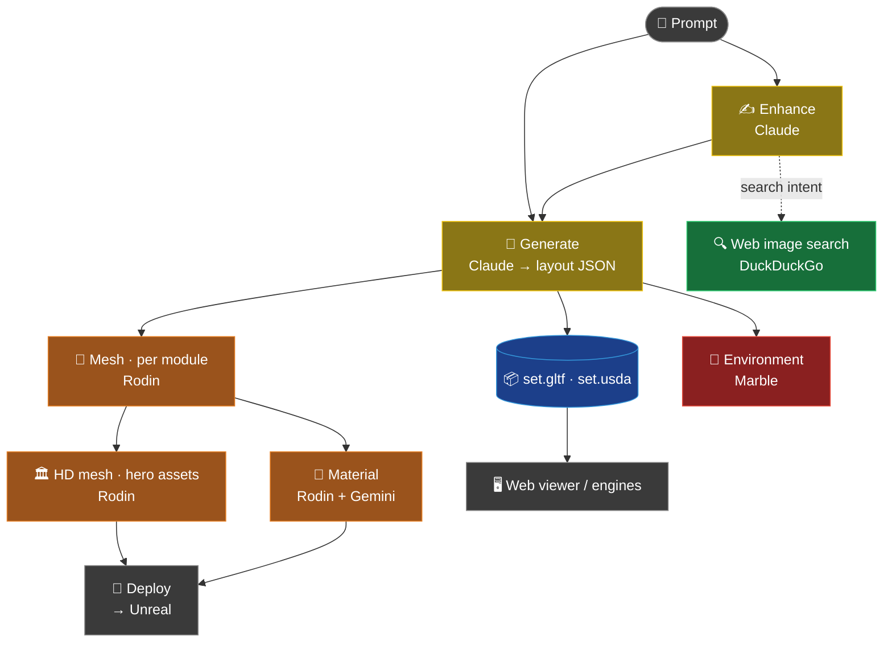
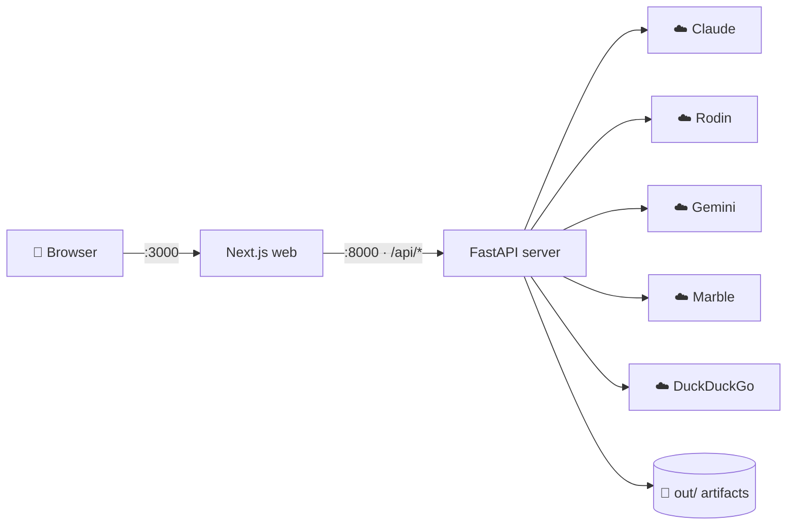

# 🎬 SetLab

> **From a text prompt to a production-ready 3D set.** SetLab orchestrates several specialized AI models into a single pipeline — *text → structured layout → 3D meshes → textures → environment* — and exports the result to **Unreal, Unity, and Blender**.

SetLab is a virtual-production / previs tool for set designers. Instead of blocking out a scene by hand, you describe it in plain language and SetLab builds a structured, editable 3D set you can preview in the browser and hand off to a game engine.

---

## ✨ Features

- 🧠 **Prompt → layout** — describe a set in natural language; an LLM produces a structured, schema-validated scene spec (modules with position / rotation / scale).
- 🧊 **Text-to-3D meshes** — per-module 3D geometry generation (Hyper3D Rodin), with an optional high-poly HD pass for hero assets.
- 🎨 **AI material enhancement** — re-texture meshes with PBR materials, guided by reference images (AI-generated or web-sourced).
- 🌄 **Environment generation** — full 3D backdrops / skyboxes (World Labs Marble).
- 🖥️ **Interactive web viewer** — real-time 3D preview plus a first-person VR walkthrough.
- 🔧 **Real-time edits** — natural-language changes (e.g. *"make the fog thicker"*, *"replace the tavern with a church"*) are classified into `instant` / `fast` / `moderate` tiers and applied accordingly.
- 🚀 **Engine export** — glTF 2.0 and USD output, with auto-deploy/import into Unreal; Blender and Unity import too.
- ⚙️ **Pluggable backends** — Claude or local **Ollama** for layout; **Gemini** or **Flux** for images; a **mock** backend for offline testing.

---

## 🗺️ How it works



Each stage is handled by a different specialized model — not several models doing the same job, but a division of labor. The heavy 3D stages (mesh, HD, material, environment) are **opt-in and configurable**, so you can iterate on layouts cheaply and only spend on geometry when you want it.

---

## 🧱 Architecture & tech stack



| Layer | Stack |
|-------|-------|
| **Frontend** | Next.js · React · TypeScript · react-three-fiber (three.js) for the 3D/VR viewer |
| **Backend** | FastAPI (Python) · httpx · pydantic · REST + Server-Sent Events |
| **Export** | glTF 2.0 (embedded buffers) · USD (USDA) |
| **Core** | Python pipeline orchestrating the AI services and engine integration |

---

## 🧠 AI models

| Stage | Model / service | Paid |
|-------|-----------------|:----:|
| Layout · refine · real-time edits · prompt enhance | **Claude** (Anthropic) — Sonnet, with Haiku for lightweight intent checks | 💸 |
| 3D mesh · HD mesh · material | **Hyper3D Rodin Gen-2** | 💸💸 |
| Reference image generation | **Google Gemini** (image models) | 💸 |
| Web image search | **DuckDuckGo** via `ddgs` | 🆓 |
| Environment generation | **World Labs Marble** | 💸💸💸 |

**Swappable alternatives:** local **Ollama** (LLM, free), **Flux** (images), and a **mock** backend (no external calls).

---

## 🚀 Getting started

### Prerequisites
- **Python 3.9+** and **Node.js 18+**
- An **Anthropic API key** (required). Optional: Hyper3D Rodin (3D meshes), Google Gemini (reference images), World Labs Marble (environments).

### Install

```bash
git clone <repository-url> setlab
cd setlab

# Python
python3 -m venv .venv && source .venv/bin/activate
pip install -r requirements.txt -r server/requirements.txt   # install BOTH

# Web
cd web && npm install && cd ..
```

### Configure

```bash
cp .env.example .env
```
Edit `.env` and add the keys you need:
```bash
ANTHROPIC_API_KEY=...        # required
RODIN_API_KEY=...            # 3D meshes
GOOGLE_API_KEY=...           # reference images
# WORLDLABS_API_KEY=...      # environments (optional)
```
> `.env` is git-ignored. Never put real keys in `.env.example`.

### Run

```bash
# Terminal 1 — API server (http://127.0.0.1:8000)
cd server && uvicorn main:app --reload --port 8000

# Terminal 2 — web app (http://localhost:3000)
cd web && npm run dev
```

Open **http://localhost:3000**, type a prompt, click **Enhance** (optional) → **Generate**.

### CLI (optional)

```bash
python -m setlab.run "a sci-fi corridor, 12m" --out out/run1 --backend claude
python -m setlab.run examples/brief_corridor.txt --out out/mock --backend mock   # offline test
```

---

## ⚙️ Configuration

Common `.env` settings:

| Variable | Purpose | Values |
|----------|---------|--------|
| `BACKEND` | Layout LLM backend | `claude` · `ollama` · `mock` |
| `IMAGE_GEN_BACKEND` | Reference-image backend | `google` · `flux` |
| `RODIN_TIER` / `RODIN_QUALITY_OVERRIDE` | Mesh quality / polycount | e.g. `Regular` / `50000` |
| `SETLAB_MAX_MODULES` | Cap on layout modules | e.g. `10` |
| `NEXT_PUBLIC_AUTO_PIPELINE_AFTER_GENERATE` | Run mesh/HD automatically after Generate | `false` · `mesh` · `mesh+hd` · `all` |
| `NEXT_PUBLIC_AUTO_STUDIO_COMPLETE` | Run material/Deploy/Marble automatically | empty · `1` · `full` |
| `SETLAB_API_TOKEN` | Optional bearer-token auth for the API | any secret |

> **Performance & cost:** the pipeline is modular. For fast, cheap iteration, set `NEXT_PUBLIC_AUTO_PIPELINE_AFTER_GENERATE=false` so Generate produces only the layout, then trigger meshes/HD/materials on demand. 3D generation (Rodin) and environments (Marble) are the heavy, billed stages.

---

## 📦 Outputs & engine import

Each run writes to `out/<run_id>/`:

| File | Contents |
|------|----------|
| `set_spec.json` | Module layout spec |
| `set.gltf` | glTF 2.0 (single file, loaded by the viewer) |
| `set.usda` | USD Stage |
| `meshes/` | Generated GLBs (when the mesh stage runs) |

| Engine | Import |
|--------|--------|
| Blender | `File → Import → glTF` |
| Unity | a glTF package (e.g. glTFast) |
| Unreal | glTF importer / Datasmith, or the `scripts/ue_set_watcher.py` auto-watcher |
| USD | `usdview set.usda` |

---

## 📂 Project structure

```
setlab/     core pipeline — LLM clients, Rodin/image-gen clients, glTF/USD export
server/     FastAPI backend (REST + SSE)
web/        Next.js frontend (3D + VR viewer, controls)
scripts/    Unreal/Blender integration and watchers
docs/       guides and design notes
examples/   sample briefs   ·   schemas/   JSON schema   ·   tests/   unit tests
```

---

## 📚 Documentation

| Doc | Contents |
|-----|----------|
| [`docs/PROJECT_SUMMARY.md`](docs/PROJECT_SUMMARY.md) | Full structure overview |
| [`docs/START_UNREAL_FIRST.md`](docs/START_UNREAL_FIRST.md) | Start with Unreal first |
| [`docs/UNREAL_AUTO_PLACEMENT.md`](docs/UNREAL_AUTO_PLACEMENT.md) | UE auto-placement |
| [`docs/UNREAL_AUTO_IMPORT_SETUP.md`](docs/UNREAL_AUTO_IMPORT_SETUP.md) | glTF → UE auto-import |
| [`docs/INZOI_STYLE_SET_STEP_BY_STEP.md`](docs/INZOI_STYLE_SET_STEP_BY_STEP.md) | inZOI-style city set, step by step |
| [`docs/PROMPT_TO_VIEWPORT.md`](docs/PROMPT_TO_VIEWPORT.md) | Prompt → engine folder copy |

---

## 🔒 Notes

- `.env` is git-ignored — keep real API keys there, never in `.env.example`.
- Recreate the Python virtual environment per machine (don't copy `.venv`), and install **both** `requirements.txt` and `server/requirements.txt`.
